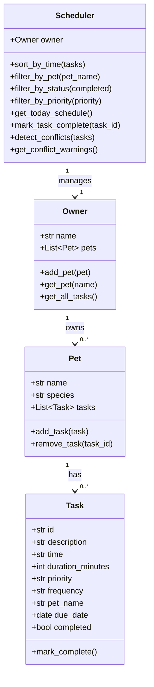

# PawPal+ — Smart Pet Care Management

PawPal+ is a Streamlit app that helps busy pet owners stay on top of daily care routines. It tracks feedings, walks, medications, and appointments for multiple pets — with algorithmic scheduling and an AI-powered Pet Care Assistant backed by a RAG pipeline.


---

## Features

| Feature | Description |
|---|---|
| **Multi-pet support** | Track any number of pets per owner |
| **Task scheduling** | Add, complete, and delete care tasks with priority and duration |
| **Sorting by time** | Schedule always displayed in chronological HH:MM order |
| **Filtering** | Filter tasks by pet, completion status, or priority |
| **Conflict warnings** | Flags tasks scheduled at the exact same time |
| **Recurring tasks** | Completing a daily/weekly task auto-creates the next occurrence |
| **AI Pet Care Assistant** | RAG-powered chatbot answers care questions using a built-in knowledge base |

---

## AI Feature: Retrieval-Augmented Generation (RAG)

The **Pet Care Assistant** tab lets you ask questions like *"how often should I walk my dog?"* or *"what vaccines does my cat need?"*. It works as follows:

1. Your question is scored against 5 pet care knowledge-base files using keyword overlap
2. The top 2 most relevant sections are retrieved
3. Those sections + your pet list are passed to **Gemini 2.0 Flash Lite** as grounded context
4. The answer is displayed alongside the sources that were retrieved

All activity (retrieved chunks, token counts, retries, errors) is logged to `pawpal.log`.


---

## Setup

```bash
python -m venv .venv
source .venv/bin/activate   # Windows: .venv\Scripts\activate
pip install -r requirements.txt
```

Copy `.env.example` to `.env` and add your Google AI Studio API key:

```bash
cp .env.example .env
# then edit .env and set GOOGLE_API_KEY=your_key_here
```

Get a free key (no credit card) at [aistudio.google.com/apikey](https://aistudio.google.com/apikey).

---

## Running the App

```bash
streamlit run app.py
```

---

## CLI Demo

Verify backend logic without the UI:

```bash
python3 main.py
```

---

## Tests

```bash
python -m pytest tests/ -v
```

19 tests covering task completion, pet management, sorting, filtering, recurrence, conflict detection, and today's schedule logic.

---

## Project Structure

```
app.py                      # Streamlit entry point — 4 tabs
main.py                     # CLI demo script
requirements.txt            # Python dependencies
.env                        # API key — not committed (see .env.example)
.env.example                # Template for .env
src/
  pawpal_system.py          # Backend: Owner, Pet, Task, Scheduler
  rag.py                    # RAG pipeline: retrieval + Gemini API
knowledge_base/
  dogs.md                   # Dog care: feeding, exercise, medications, vet
  cats.md                   # Cat care
  rabbits.md                # Rabbit care
  birds.md                  # Bird care
  general.md                # Cross-species tips, emergency signs
assets/
  PawPal.png                # App screenshot
  architecture.png          # System architecture diagram
docs/
  reflection.md             # Design decisions and AI collaboration notes
scripts/
  generate_diagram.py       # Regenerates assets/architecture.png
tests/
  test_pawpal.py            # 19 automated pytest tests
```

---

## System Architecture (UML)


