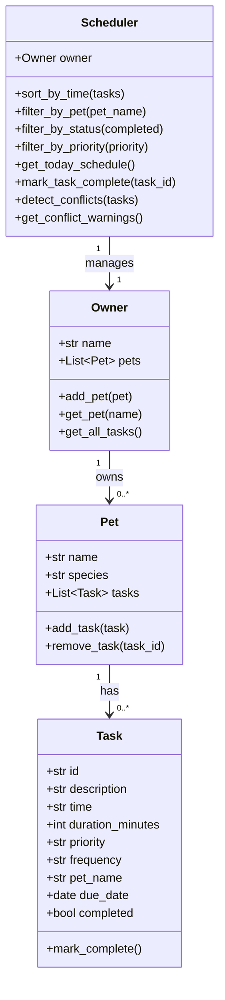
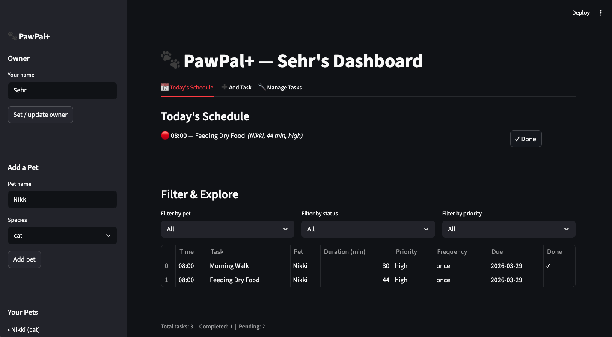

# PawPal+ — Smart Pet Care Management

PawPal+ is a Streamlit app that helps busy pet owners stay on top of daily care routines. It tracks feedings, walks, medications, and appointments for multiple pets — using algorithmic scheduling logic to sort, filter, detect conflicts, and handle recurring tasks automatically.

---

## System Architecture (UML)



---

## Features

| Feature | Description |
|---|---|
| **Multi-pet support** | Track any number of pets per owner |
| **Task management** | Add, complete, and delete care tasks with priority and duration |
| **Sorting by time** | Schedule is always displayed in chronological HH:MM order |
| **Filtering** | Filter tasks by pet, completion status, or priority |
| **Conflict warnings** | Flags tasks scheduled at the exact same time across pets |
| **Daily & weekly recurrence** | Completing a recurring task auto-creates the next occurrence |
| **Persistent session** | All data lives in `st.session_state` — no page-refresh data loss |

---

## Smarter Scheduling

- **Sorting:** Tasks are sorted using Python's `sorted()` with a `lambda` key on the `HH:MM` time string, which sorts correctly lexicographically for zero-padded 24-hour times.
- **Conflict detection:** The Scheduler compares every pair of tasks in today's schedule; any pair sharing an exact time string is flagged with a human-readable warning.
- **Recurring tasks:** When `mark_task_complete()` is called on a `daily` or `weekly` task, a new `Task` instance is created using Python's `timedelta` and added to the same pet's task list.

---

## Setup

```bash
python -m venv .venv
source .venv/bin/activate   # Windows: .venv\Scripts\activate
pip install -r requirements.txt
```

---

## Running the App

```bash
streamlit run app.py
```

---

## CLI Demo

To verify backend logic without the UI:

```bash
python main.py
```

Sample output:
```
==================================================
  TODAY'S SCHEDULE
==================================================
  [○] 07:00 — Morning walk (Mochi, 30min, high)
  [○] 08:00 — Heartworm pill (Mochi, 5min, high)
  [○] 08:00 — Wet food (Luna, 10min, high)
  ...

==================================================
  CONFLICT WARNINGS
==================================================
  ⚠  Conflict at 08:00: 'Heartworm pill' (Mochi) clashes with 'Wet food' (Luna)
```

---

## Testing PawPal+

Run the full automated test suite:

```bash
python -m pytest tests/ -v
```

The suite covers 19 tests across these behaviours:

| Category | Tests |
|---|---|
| Task completion | `mark_complete()` changes status; idempotent |
| Pet task management | Add/remove tasks; count changes correctly |
| Owner aggregation | `get_all_tasks()` spans all pets |
| Sorting | Chronological order; stable with one task |
| Filtering | By pet, by status |
| Daily recurrence | Next task created for tomorrow; not yet complete |
| Weekly recurrence | Next task created seven days later |
| One-time tasks | No follow-up task created |
| Conflict detection | Same-time clash detected; different times pass |
| Today's schedule | Excludes future and completed tasks |

**Confidence: ★★★★☆** — core scheduling behaviors are thoroughly covered. Edge cases around overlapping durations (rather than exact time matches) and multi-timezone support would be next steps.

---

## 📸 Demo



---

## Project Structure

```
pawpal_system.py   # All backend logic (Owner, Pet, Task, Scheduler)
main.py            # CLI demo script
app.py             # Streamlit UI
tests/
  test_pawpal.py   # 19 automated pytest tests
reflection.md      # Design decisions and AI collaboration notes
requirements.txt   # streamlit, pytest
```
