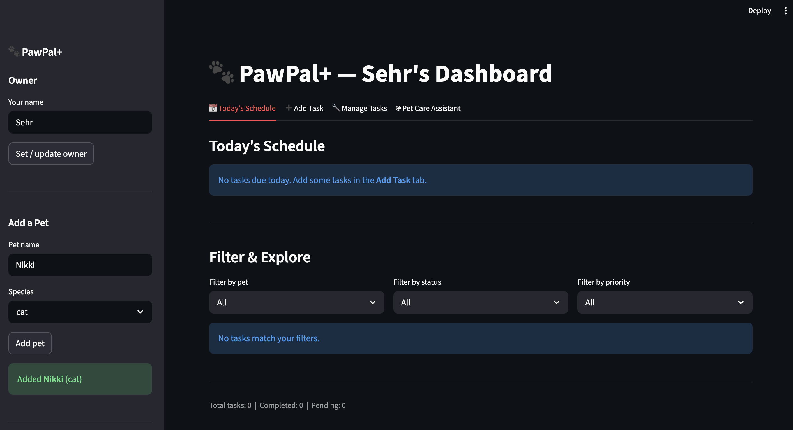
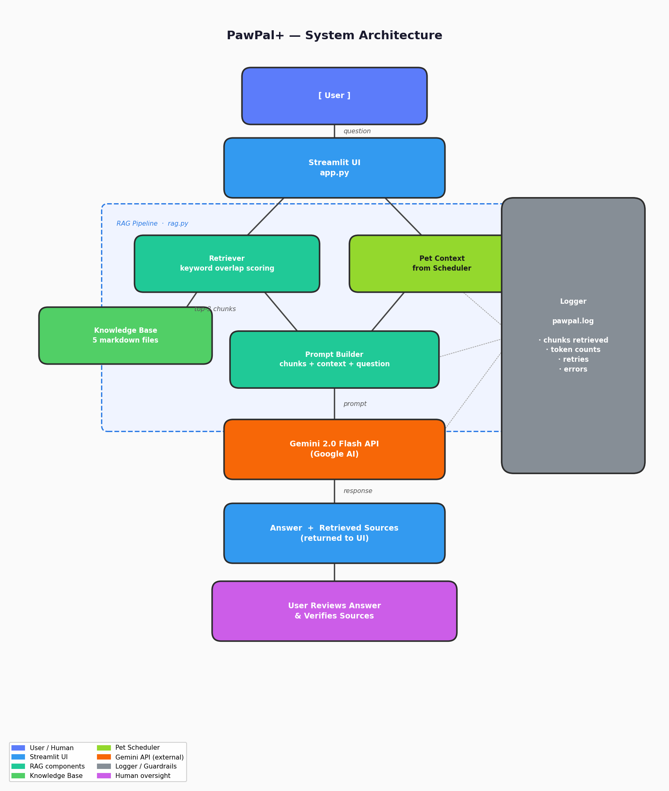
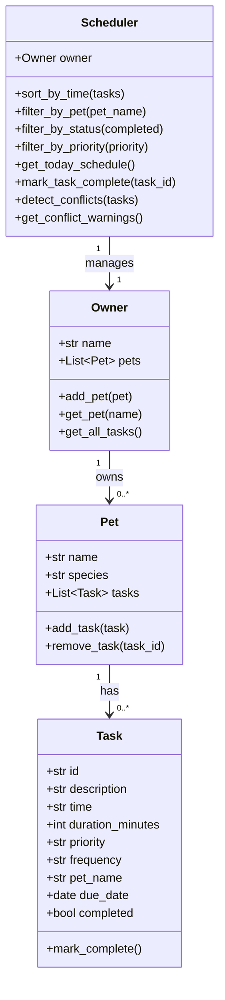

# PawPal+ — Applied AI Pet Care System

PawPal+ is a Streamlit application that helps busy pet owners manage daily care routines across multiple pets, extended with an AI-powered Pet Care Assistant that uses Retrieval-Augmented Generation (RAG) to answer pet health and care questions grounded in a curated knowledge base.



---

## Original Project

This project extends **PawPal+**, originally built in Module 3 of AI110. The original system was a pure-algorithmic pet care scheduler: it tracked tasks (feedings, walks, medications, vet appointments) across multiple pets, sorted them chronologically, detected scheduling conflicts, and auto-generated recurring task occurrences. It had no AI integration — all logic was rule-based Python. This extension adds a fully integrated RAG pipeline and conversational AI assistant as a fourth tab in the existing Streamlit UI.

---

## What It Does

PawPal+ lets pet owners:
- **Schedule and track** care tasks with priority levels, durations, and recurrence (daily/weekly)
- **Detect conflicts** when two tasks are scheduled at the same time
- **Ask the AI assistant** questions about pet care — feeding schedules, medications, vet visits, grooming — and receive answers grounded in a curated knowledge base rather than generic model responses

The AI feature meaningfully changes how the system works: instead of the user Googling "how often should I deworm my rabbit," they ask inside the app and the AI retrieves the relevant section of the knowledge base before answering.

---

## AI Feature: Retrieval-Augmented Generation (RAG)

The **Pet Care Assistant** tab implements a full RAG pipeline:

1. The user submits a question (e.g., *"what vaccines does my cat need?"*)
2. `retrieve()` in `src/rag.py` scores all 28 knowledge-base sections against the query using keyword overlap, filtering out stopwords
3. The top 2 most relevant sections are selected
4. Those sections, the user's pet list (from the Scheduler), and the question are assembled into a prompt
5. The prompt is sent to **Gemini 2.0 Flash Lite** via the Google AI API
6. The answer is displayed in the UI alongside an expandable panel showing which knowledge-base sources were used
7. All activity is logged to `pawpal.log`

The retrieval step is what makes this RAG rather than plain chat: the model is explicitly constrained to answer using only the retrieved documents, and the sources are shown to the user so they can verify.

---

## Architecture Overview

The system has four layers:

- **User Interface** (`app.py`): Streamlit UI with four tabs — Today's Schedule, Add Task, Manage Tasks, and Pet Care Assistant. All state is held in `st.session_state`.
- **Scheduler Backend** (`src/pawpal_system.py`): Owner → Pet → Task data model with sorting, filtering, conflict detection, and recurring task logic.
- **RAG Pipeline** (`src/rag.py`): Retriever scores knowledge-base chunks by keyword overlap; top results are passed with pet context to the Gemini API.
- **Knowledge Base** (`knowledge_base/`): Five markdown files (dogs, cats, rabbits, birds, general) split into 28 sections covering feeding, exercise, medications, vet visits, grooming, and emergency signs.

Human oversight is built in: retrieved source documents are shown under every AI response so the user can read the original material and verify the answer before acting on it.



---

## Setup

```bash
# 1. Clone the repo and create a virtual environment
git clone https://github.com/sehr-abrar/pawpal-v2.git
cd pawpal-v2
python -m venv .venv
source .venv/bin/activate      # Windows: .venv\Scripts\activate

# 2. Install dependencies
pip install -r requirements.txt

# 3. Set up your API key
cp .env.example .env
# Open .env and set: GOOGLE_API_KEY=your_key_here
```

Get a free Google AI Studio key (no credit card) at [aistudio.google.com/apikey](https://aistudio.google.com/apikey).

```bash
# 4. Run the app
streamlit run app.py
```

---

## Sample Interactions

### Example 1 — Feeding schedule question

**Input:** `How often should I feed my dog?`

**Retrieved source:** `dogs` → Feeding Schedule section

**AI Output:**
> Adult dogs should be fed **2 times per day**, roughly 12 hours apart. Puppies under 6 months need 3–4 meals daily. Senior dogs (7+ years) may do better on 2–3 smaller meals to aid digestion. Always measure portions by the calorie guidelines on food packaging to avoid obesity, and provide fresh water at all times.

---

### Example 2 — Vaccination question

**Input:** `What vaccines does my cat need and how often?`

**Retrieved source:** `cats` → Medications and Preventatives section

**AI Output:**
> Core vaccines for cats include:
> - **Rabies** — annually or every 3 years depending on local regulations
> - **FVRCP** (feline viral rhinotracheitis, calicivirus, panleukopenia) — every 1–3 years after the kitten series
> - **FeLV** (feline leukemia) — recommended for outdoor cats or multi-cat households
>
> Monthly flea prevention is also advised even for indoor cats. Consult your vet to confirm the schedule appropriate for your cat's lifestyle.

---

### Example 3 — Emergency/warning signs question

**Input:** `My rabbit hasn't eaten since this morning, should I be worried?`

**Retrieved source:** `rabbits` → Warning Signs Requiring Urgent Vet Attention section

**AI Output:**
> Yes — this is a serious concern. Rabbits not eating for even a few hours can signal **GI stasis**, a life-threatening condition where the digestive system slows or stops. Signs to watch for alongside not eating include: no droppings, hunched posture, and teeth grinding. GI stasis requires **immediate veterinary care**. Do not wait to see if it improves on its own. I strongly recommend calling a rabbit-savvy exotic vet now.

---

## Design Decisions

**Why keyword overlap instead of embeddings?**
Semantic search (via vector embeddings) would be more accurate but requires either an embedding API call per query or a local model. For a free-tier student project, every extra API call increases cost and latency. Keyword overlap with stopword filtering is deterministic, fast, and good enough for a domain-specific knowledge base of 28 sections — the vocabulary is controlled and consistent.

**Why a local knowledge base instead of web search?**
Web search introduces latency, unreliable sources, and hallucination risk. A curated local knowledge base gives the AI bounded, trustworthy material to work from, and lets us show exactly which source the answer came from.

**Why keep the scheduler and RAG separate?**
`pawpal_system.py` handles all task/pet logic with no AI dependency. `rag.py` handles all AI logic with no scheduler dependency. This means the original 19 tests still pass unchanged, and the RAG feature can be swapped or upgraded without touching the scheduler.

**Tradeoff accepted:** Keyword overlap misses synonyms (e.g., "jab" won't match "vaccine"). A production system would use embeddings. For this scope, the trade-off in favor of simplicity and zero extra cost is justified.

---

## Testing Summary

**Backend scheduler (automated):** 19 pytest tests — all pass. Covers task completion, recurrence, filtering, sorting, conflict detection, and today's schedule logic.

```bash
python -m pytest tests/ -v
# 19 passed in 0.09s
```

**RAG retrieval (test harness):** `scripts/test_harness.py` runs 6 predefined queries against the retriever and checks that the expected knowledge-base source appears in the top-2 results.

```bash
python3 scripts/test_harness.py
```

**What worked:** Retrieval is reliable for species-specific questions. Keyword overlap handles the domain vocabulary well because the knowledge base is tightly scoped.

**What didn't:** Gemini 2.0 Flash hit aggressive rate limits on the free tier (429 errors). Fixed with exponential backoff retry logic (5s → 10s → 20s → 40s). `gemini-2.0-flash-lite` was ultimately the most stable free-tier option.

**What I learned:** Chunk size has a larger impact on API quota than request frequency. Truncating each retrieved section to 800 characters reduced token consumption by ~70% and resolved most quota issues.

---

## Demo Walkthrough

> 🎥 **Video Placeholder:**

---

## Reflection

Building this project made clear that the hardest part of applied AI engineering is not the model call — it's everything around it. The model call is five lines. The retrieval logic, the prompt design, the error handling, the rate-limit retry, the UI wiring, and the decision about what to show the user took the other 95% of the time.

The most important lesson: **retrieval quality determines answer quality more than model choice does.** When the retriever pulled the wrong section, the AI produced a plausible but irrelevant answer. When retrieval was correct, even the lightest model gave a useful response. This suggests that for RAG systems, investing in the knowledge base and retrieval logic pays off more than upgrading to a larger model.

See `docs/model_card.md` for a full reflection on limitations, ethics, and AI collaboration.

---

## Project Structure

```
app.py                      # Streamlit entry point — 4 tabs
main.py                     # CLI demo script
requirements.txt            # Python dependencies
.env                        # API key (gitignored — see .env.example)
.env.example                # Template for .env
src/
  __init__.py
  pawpal_system.py          # Backend: Owner, Pet, Task, Scheduler classes
  rag.py                    # RAG pipeline: retrieval + Gemini API call
knowledge_base/
  dogs.md                   # Dog care: feeding, exercise, medications, vet
  cats.md                   # Cat care
  rabbits.md                # Rabbit care
  birds.md                  # Bird care
  general.md                # Cross-species tips, medications, emergencies
assets/
  PawPal.png                # App screenshot
  architecture.png          # System architecture diagram
docs/
  model_card.md             # AI ethics reflection and design notes
scripts/
  generate_diagram.py       # Regenerates assets/architecture.png
  test_harness.py           # RAG reliability evaluation script
tests/
  test_pawpal.py            # 19 automated pytest tests
```

---

## System Architecture (UML)


